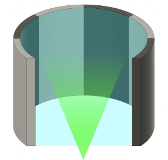
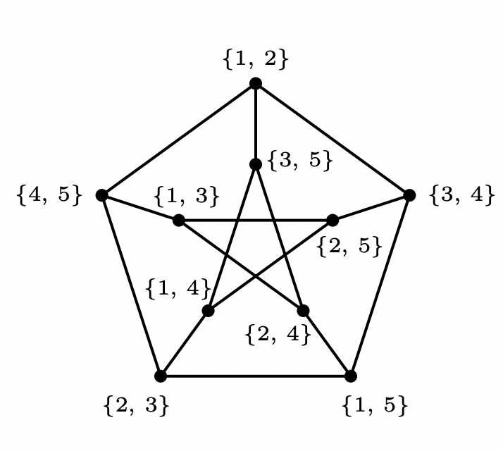

I am a second year [ECE](https://www.ece.cmu.edu/index.html) Ph.D. student at [Carnegie Mellon University](https://en.wikipedia.org/wiki/Carnegie_Mellon_University). I've been very fortunate to be a part of [the Geometry Collective](http://geometry.cs.cmu.edu/) and to be advised by [Keenan Crane](https://www.cs.cmu.edu/~kmcrane/). In summer 2023, I interned at [Adobe](https://www.adobe.com/), where I had the pleasure of working with [Alec Jacobson](https://www.cs.toronto.edu/~jacobson/) and [Qingnan Zhou](https://research.adobe.com/person/qingnan-zhou/) on physics-related problems.
  
Previously, I graduated from [Sharif University of Technology](https://en.wikipedia.org/wiki/Sharif_University_of_Technology) with a B.S. in Computer Engineering and a minor in Mathematics. A copy of my CV can be found [here](https://hbaktash.github.io/files/CV%20Hossein_Baktash.pdf).

Research
====
My research interest broadly is geometry processing and computer graphics. I find it rewarding to learn about Differential Geometry and Topology and to apply that knowledge to the discrete domain when possible.

Before doing geometry, I used to do [Computational Imaging](https://en.wikipedia.org/wiki/Computational_imaging); where I got to learn some optics and acoustics and did some physical experiments. In my undergraduate years, I worked on Graph Theory and Statistics problems.

Publications
=====

**[Computational Imaging using Ultrasonically-Sculpted Virtual Lenses](http://hbaktash.github.io/files/DeBlurUS_ICCP22.pdf)**\
Hossein Baktash, Yash Belhe, Matteo Giuseppe Scopelliti, Yi Hua, Aswin C Sankaranarayanan, Maysamreza Chamanzar \
ICCP 2022

\

**[Some Results on Dominating Induced Matchings](https://arxiv.org/pdf/1912.00511)**\
S Akbari, H Baktash, A Behjati, A Behmaram, M Roghani\
Graphs and Combinatorics 38 (3), 73

Misc
=====
I've been a member of the CMU [pool](https://en.wikipedia.org/wiki/Pool_(cue_sports)) team and club. Back in Iran, I was lucky to be 
a part of [Sharif University's Mountaineering Club](https://www.instagram.com/hamnavard.sharif/) family.
